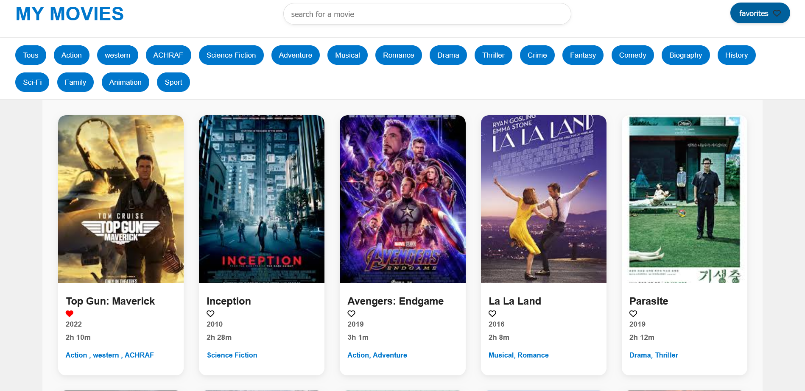

# 🎬 My Movies Library

An interactive movie library built with **HTML, CSS, and JavaScript**.  
Users can explore movies, add them to favorites, and have their choices remembered using **localStorage**.

---

## 🚀 Features

- 📚 Browse and display a collection of movies
- ❤️ Add/remove movies to/from your favorites list
- 💾 Favorites are saved in **localStorage** (persist after reload)
- 🎨 Clean and responsive UI with pure CSS
- ⚡ Simple, lightweight, and fast (no frameworks)

---

## 🛠️ Tech Stack

- **HTML5**
- **CSS3**
- **JavaScript (Vanilla)**

---

## 📸 Demo Preview

<!-- _(Add a screenshot of your app here)_ -->

It should be simply:

```markdown

```
